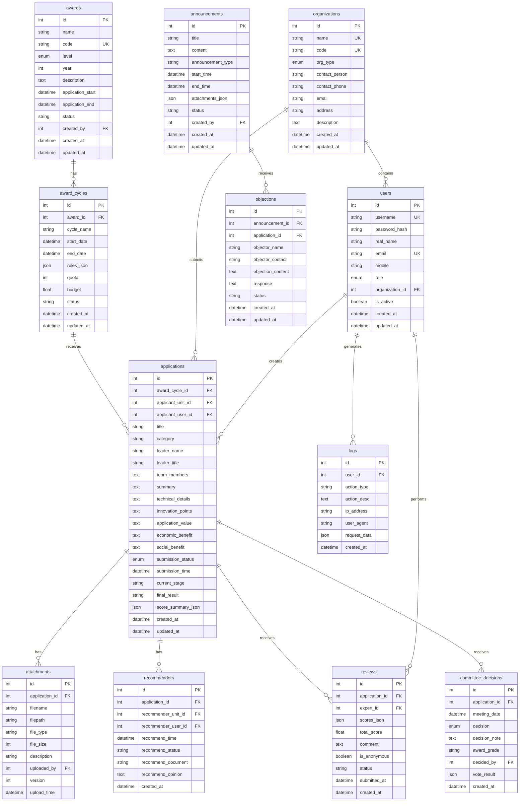

# XXXX协会科学技术奖评审管理系统 - 数据库设计文档

## 数据库ER图

## 表结构说明

### 1. users (用户表)

用于存储系统所有用户信息。

| 字段 | 类型 | 说明 |
|------|------|------|
| id | INT | 主键 |
| username | VARCHAR(50) | 用户名，唯一 |
| password_hash | VARCHAR(255) | 密码哈希 |
| real_name | VARCHAR(50) | 真实姓名 |
| email | VARCHAR(100) | 邮箱，唯一 |
| mobile | VARCHAR(20) | 手机号 |
| role | ENUM | 角色：admin/staff/recommender/applicant/expert/committee/public |
| organization_id | INT | 所属组织ID，外键 |
| is_active | BOOLEAN | 是否激活 |
| created_at | DATETIME | 创建时间 |
| updated_at | DATETIME | 更新时间 |

**索引:**
- PRIMARY KEY (id)
- UNIQUE KEY (username)
- UNIQUE KEY (email)
- INDEX (organization_id)

### 2. organizations (组织表)

存储企业、研究院所、高校、协会等组织信息。

| 字段 | 类型 | 说明 |
|------|------|------|
| id | INT | 主键 |
| name | VARCHAR(200) | 组织名称，唯一 |
| code | VARCHAR(50) | 组织代码，唯一 |
| org_type | ENUM | 组织类型：enterprise/institute/university/association/other |
| contact_person | VARCHAR(50) | 联系人 |
| contact_phone | VARCHAR(20) | 联系电话 |
| email | VARCHAR(100) | 邮箱 |
| address | VARCHAR(255) | 地址 |
| description | TEXT | 简介 |
| created_at | DATETIME | 创建时间 |
| updated_at | DATETIME | 更新时间 |

**索引:**
- PRIMARY KEY (id)
- UNIQUE KEY (name)
- UNIQUE KEY (code)

### 3. awards (奖项表)

定义各类奖项。

| 字段 | 类型 | 说明 |
|------|------|------|
| id | INT | 主键 |
| name | VARCHAR(100) | 奖项名称 |
| code | VARCHAR(50) | 奖项代码，唯一 |
| level | ENUM | 级别：national/industry/provincial |
| year | INT | 年度 |
| description | TEXT | 说明 |
| application_start | DATETIME | 申报开始时间 |
| application_end | DATETIME | 申报结束时间 |
| status | VARCHAR(20) | 状态 |
| created_by | INT | 创建人ID |
| created_at | DATETIME | 创建时间 |
| updated_at | DATETIME | 更新时间 |

**索引:**
- PRIMARY KEY (id)
- UNIQUE KEY (code)

### 4. award_cycles (奖项轮次表)

管理奖项的评审轮次。

| 字段 | 类型 | 说明 |
|------|------|------|
| id | INT | 主键 |
| award_id | INT | 奖项ID，外键 |
| cycle_name | VARCHAR(100) | 轮次名称 |
| start_date | DATETIME | 开始日期 |
| end_date | DATETIME | 结束日期 |
| rules_json | JSON | 评审规则 |
| quota | INT | 名额 |
| budget | FLOAT | 预算 |
| status | VARCHAR(20) | 状态 |
| created_at | DATETIME | 创建时间 |
| updated_at | DATETIME | 更新时间 |

**索引:**
- PRIMARY KEY (id)
- INDEX (award_id)

### 5. applications (申报表)

核心表，存储所有申报信息。

| 字段 | 类型 | 说明 |
|------|------|------|
| id | INT | 主键 |
| award_cycle_id | INT | 奖项轮次ID，外键 |
| applicant_unit_id | INT | 申报单位ID，外键 |
| applicant_user_id | INT | 申报人ID，外键 |
| title | VARCHAR(200) | 项目名称 |
| category | VARCHAR(50) | 申报类别 |
| leader_name | VARCHAR(50) | 负责人 |
| leader_title | VARCHAR(50) | 负责人职称 |
| team_members | TEXT | 团队成员 |
| summary | TEXT | 摘要 |
| technical_details | TEXT | 技术详情 |
| innovation_points | TEXT | 创新点 |
| application_value | TEXT | 应用价值 |
| economic_benefit | TEXT | 经济效益 |
| social_benefit | TEXT | 社会效益 |
| submission_status | ENUM | 状态：draft/submitted/recommended/... |
| submission_time | DATETIME | 提交时间 |
| current_stage | VARCHAR(50) | 当前阶段 |
| final_result | VARCHAR(50) | 最终结果 |
| score_summary_json | JSON | 评分汇总 |
| created_at | DATETIME | 创建时间 |
| updated_at | DATETIME | 更新时间 |

**索引:**
- PRIMARY KEY (id)
- INDEX (award_cycle_id)
- INDEX (applicant_unit_id)
- INDEX (submission_status)

### 6. attachments (附件表)

存储申报相关的附件。

| 字段 | 类型 | 说明 |
|------|------|------|
| id | INT | 主键 |
| application_id | INT | 申报ID，外键 |
| filename | VARCHAR(255) | 文件名 |
| filepath | VARCHAR(500) | 文件路径 |
| file_type | VARCHAR(20) | 文件类型 |
| file_size | INT | 文件大小(字节) |
| description | VARCHAR(255) | 描述 |
| uploaded_by | INT | 上传人ID |
| version | INT | 版本号 |
| upload_time | DATETIME | 上传时间 |

**索引:**
- PRIMARY KEY (id)
- INDEX (application_id)

### 7. recommenders (推荐单位表)

管理推荐单位的推荐信息。

| 字段 | 类型 | 说明 |
|------|------|------|
| id | INT | 主键 |
| application_id | INT | 申报ID，外键 |
| recommender_unit_id | INT | 推荐单位ID，外键 |
| recommender_user_id | INT | 推荐人ID，外键 |
| recommend_time | DATETIME | 推荐时间 |
| recommend_status | VARCHAR(20) | 推荐状态 |
| recommend_document | VARCHAR(500) | 推荐文件路径 |
| recommend_opinion | TEXT | 推荐意见 |
| created_at | DATETIME | 创建时间 |

**索引:**
- PRIMARY KEY (id)
- INDEX (application_id)

### 8. reviews (评审表)

专家评审记录。

| 字段 | 类型 | 说明 |
|------|------|------|
| id | INT | 主键 |
| application_id | INT | 申报ID，外键 |
| expert_id | INT | 专家ID，外键 |
| scores_json | JSON | 各项评分 |
| total_score | FLOAT | 总分 |
| comment | TEXT | 评审意见 |
| is_anonymous | BOOLEAN | 是否匿名 |
| status | VARCHAR(20) | 状态：pending/draft/submitted |
| submitted_at | DATETIME | 提交时间 |
| created_at | DATETIME | 创建时间 |

**索引:**
- PRIMARY KEY (id)
- INDEX (application_id)
- INDEX (expert_id)

### 9. committee_decisions (评审委员会决议表)

评审委员会的终审决议。

| 字段 | 类型 | 说明 |
|------|------|------|
| id | INT | 主键 |
| application_id | INT | 申报ID，外键 |
| meeting_date | DATETIME | 会议日期 |
| decision | ENUM | 决议：approved/rejected/conditional/deferred |
| decision_note | TEXT | 决议说明 |
| award_grade | VARCHAR(50) | 奖励等级 |
| decided_by | INT | 决议人ID |
| vote_result | JSON | 投票结果 |
| created_at | DATETIME | 创建时间 |

**索引:**
- PRIMARY KEY (id)
- INDEX (application_id)

### 10. announcements (公示表)

公示信息。

| 字段 | 类型 | 说明 |
|------|------|------|
| id | INT | 主键 |
| title | VARCHAR(200) | 标题 |
| content | TEXT | 内容 |
| announcement_type | VARCHAR(50) | 公示类型 |
| start_time | DATETIME | 开始时间 |
| end_time | DATETIME | 结束时间 |
| attachments_json | JSON | 附件 |
| status | VARCHAR(20) | 状态 |
| created_by | INT | 创建人ID |
| created_at | DATETIME | 创建时间 |
| updated_at | DATETIME | 更新时间 |

**索引:**
- PRIMARY KEY (id)
- INDEX (status)

### 11. objections (异议表)

公示期间的异议记录。

| 字段 | 类型 | 说明 |
|------|------|------|
| id | INT | 主键 |
| announcement_id | INT | 公示ID，外键 |
| application_id | INT | 相关申报ID，外键 |
| objector_name | VARCHAR(100) | 异议人姓名 |
| objector_contact | VARCHAR(100) | 异议人联系方式 |
| objection_content | TEXT | 异议内容 |
| response | TEXT | 回复 |
| status | VARCHAR(20) | 处理状态 |
| created_at | DATETIME | 创建时间 |
| updated_at | DATETIME | 更新时间 |

**索引:**
- PRIMARY KEY (id)
- INDEX (announcement_id)

### 12. logs (操作日志表)

系统操作审计日志。

| 字段 | 类型 | 说明 |
|------|------|------|
| id | INT | 主键 |
| user_id | INT | 用户ID，外键 |
| action_type | VARCHAR(50) | 操作类型 |
| action_desc | TEXT | 操作描述 |
| ip_address | VARCHAR(50) | IP地址 |
| user_agent | VARCHAR(255) | 用户代理 |
| request_data | JSON | 请求数据 |
| created_at | DATETIME | 创建时间 |

**索引:**
- PRIMARY KEY (id)
- INDEX (user_id)
- INDEX (created_at)

## 数据字典

### 用户角色 (UserRole)

| 值 | 说明 |
|----|------|
| admin | 系统管理员 |
| staff | 协会工作人员 |
| recommender | 推荐单位管理员 |
| applicant | 申报单位 |
| expert | 专家评审 |
| committee | 评审委员会 |
| public | 公众 |

### 组织类型 (OrgType)

| 值 | 说明 |
|----|------|
| enterprise | 企业 |
| institute | 研究院所 |
| university | 高校 |
| association | 协会 |
| other | 其他 |

### 奖项级别 (AwardLevel)

| 值 | 说明 |
|----|------|
| national | 国家级 |
| industry | 行业级 |
| provincial | 省级 |

### 申报状态 (ApplicationStatus)

| 值 | 说明 |
|----|------|
| draft | 草稿 |
| submitted | 已提交 |
| recommended | 推荐通过 |
| preliminary_approved | 初审通过 |
| preliminary_rejected | 初审不通过 |
| expert_review | 专家评审中 |
| committee_review | 评委会终审中 |
| approved | 终审通过 |
| rejected | 终审不通过 |
| announced | 已公示 |
| archived | 已归档 |

### 决议类型 (DecisionType)

| 值 | 说明 |
|----|------|
| approved | 通过 |
| rejected | 不通过 |
| conditional | 有条件通过 |
| deferred | 延期 |

## 数据库性能优化建议

1. **索引优化**
   - 在常用查询字段上创建索引
   - 避免过多索引影响写入性能
   - 定期分析索引使用情况

2. **分区表**
   - 对日志表按时间分区
   - 对申报表按年度分区

3. **查询优化**
   - 避免SELECT *
   - 使用JOIN替代子查询
   - 合理使用缓存

4. **数据归档**
   - 定期归档历史数据
   - 保留近2-3年活跃数据

---

**数据库设计** v1.0.0
